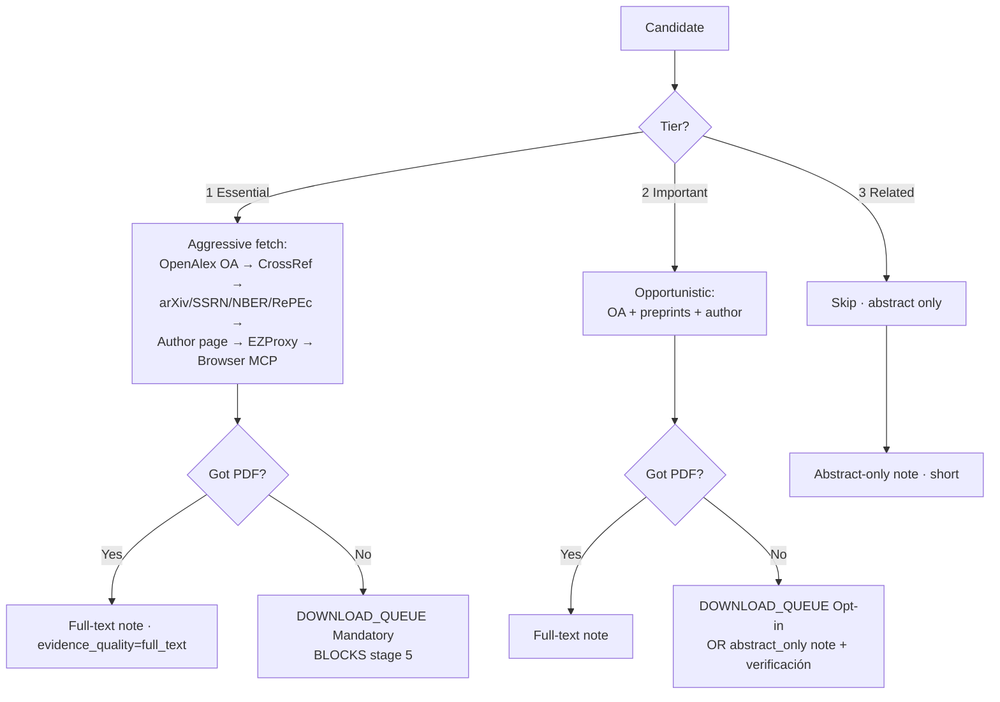

# lit-review-for-econ — one-page summary

> Diseño v0 propuesto por Claude, revisado por Codex, pendiente
> tu green-light. Detalle completo en [DESIGN.md](DESIGN.md).

## En una frase

Un sistema reusable de **skills + sub-agents** que se instala dentro
de la carpeta de un paper y lo lleva de "lee la carpeta" → preguntarte
→ buscar → cribar → leer → curar → redactar → QA, manteniendo a Claude
+ Codex + tú coordinados via el protocolo `agent-filesystem-collaboration`.

## Pipeline (9 etapas, v0.1 corta en la 5)


| # | Skill | Output | Sub-agent | v0.1 |
|---|---|---|---|---|
| 0 | `/lit-review-init` | `CONFIG.md` | claude | ✅ |
| 1 | `/lit-review-scope` | `SCOPE.md` (+≤5 preguntas) | `paper-scoper` | ✅ |
| 2 | `/lit-review-plan` | `SEARCH_PLAN.md` | `lit-search-strategist` | ✅ |
| 3 | `/lit-review-fetch` | `CANDIDATES.jsonl`, `SEARCH_LOG.md`, `DOWNLOAD_QUEUE.md` | `lit-retriever` (Codex) | ✅ |
| 4 | `/lit-review-screen` | `SCREENED.md` + tiers en JSONL | `lit-screener` | ✅ |
| 5 | `/lit-review-read` | `READING_NOTES/<citekey>.md` | `paper-reader` | ✅ |
| 6 | `/lit-review-curate` | `SYNTHESIS.md` + `OUTLINE.md` | `lit-curator` | v0.2 |
| 7 | `/lit-review-draft` | `DRAFT.tex` + `lib.bib` | `lit-writer` | v0.2 |
| 8 | `/lit-review-qa` | `QA.md` | `lit-reviewer-qa` | v0.2 |

## Quién hace qué (runtime)

```text
┌────────────────────────────────────────────────────────────────┐
│                       Carpeta del paper                        │
│                                                                │
│   ┌──────────────┐         ┌──────────────┐                    │
│   │   Claude     │ ←────→  │    Codex     │                    │
│   │              │  coord/ │              │                    │
│   │ scope · plan │ threads │ fetch · bib  │                    │
│   │ screen·judge │  HUMAN  │ schema · QA  │                    │
│   │ read · curate│  STATE  │ mech audits  │                    │
│   │ draft (prose)│         │              │                    │
│   └──────┬───────┘         └──────┬───────┘                    │
│          │                        │                            │
│          └────────────┬───────────┘                            │
│                       ▼                                        │
│              ┌──────────────────┐                              │
│              │  Kristian        │ ← decisiones únicas suyas    │
│              │  (HUMAN.md +     │   van aquí; cada etapa       │
│              │   chat directo)  │   tiene presupuesto ≤3 Qs    │
│              └──────────────────┘                              │
└────────────────────────────────────────────────────────────────┘
```

Cualquier agente puede correr el pipeline solo en modo degradado y lo
registra en `ASSUMPTIONS.md`.

## Artefactos en `lit-review/` dentro de la carpeta del paper

```text
lit-review/
├── CONFIG.md           # stack de herramientas, idioma, paths, fuentes, flags (EZProxy, browser MCP)
├── .secrets/
│   └── ezproxy-cookies.txt  # cookies UCSC (gitignored)
├── SCOPE.md            # RQ, hipótesis, identification, contribución, JEL, must-cite
├── SEARCH_PLAN.md      # queries, JEL, autores semilla, landmarks
├── SEARCH_LOG.md       # qué corrimos, cuándo, contra qué backend, qué cayó
├── CANDIDATES.jsonl    # canónico: doi, tier (1/2/3), tier_source, fetch_policy, fetch_attempts, evidence_quality
├── DOWNLOAD_QUEUE.md   # 3 secciones: Mandatory (T1) · Opt-in (T2) · Substitutes
├── DOWNLOADS/          # PDFs bajados (auto + manual)
├── SCREENED.md         # resumen humano del JSONL
├── READING_NOTES/      # 1 archivo por paper aceptado; frontmatter con evidence_quality
├── SYNTHESIS.md        # clusters + gap
├── OUTLINE.md          # plan párrafo-por-párrafo
├── DRAFT.tex           # la sección
├── lib.bib             # entradas a fusionar en el .bib del paper
├── QA.md               # auditoría claim-a-fuente, audita evidence_quality
└── ASSUMPTIONS.md      # defaults sin tu confirmación + degradaciones registradas
```

## 🆕 Política de evidencia por tier (§2.11 propuesta, en debate)

Cada paper candidato lleva un **tier** que controla (a) qué tan agresivo
es el retriever, (b) qué claims puede hacer el writer, (c) si aparece
en `DOWNLOAD_QUEUE.md`.

| Tier | Nombre | `fetch_policy` | Evidence mínima | Note depth | En queue? |
|------|--------|----------------|-----------------|------------|-----------|
| **1 Esencial** | Tú must-cite + screener | **agresivo**: OA → CrossRef → arXiv/SSRN/NBER → autor → **EZProxy (cookies)** → manual queue | `full_text` obligatorio | Nota larga: question, design, sample, identification, estimates con `(p. NN)`, robustness, limits, relevance | Mandatory |
| **2 Importante** | Screener | **oportunista**: OA + preprints + autor; si bloqueado, abstract + verificación cruzada | `full_text` preferido; `abstract_only` ok con verificación | Mid: estructura T1 hasta donde la evidencia aguante | Opt-in |
| **3 Relacionado** | Screener | **skip**: abstract solo del API; nunca intenta PDF | `abstract_only` | Corto: claim + por-qué-relevante | No |



**Reglas del writer por evidence_quality:**

| `evidence_quality` | Puede citar para | NO puede citar para |
|---|---|---|
| `full_text` | Cualquier claim con `(p. NN)` | nada |
| `substitute_version` (working paper en vez del published) | Claims alto-nivel + metodología | Números específicos del published version |
| `abstract_only` | "La literatura ha explorado Y", positioning | Effect sizes, mechanisms, robustness, identification details |
| `none` | nada — cite refused at draft time | todo |

**Promotion mid-pipeline**: si el reader (etapa 5) descubre que un Tier 3 es realmente esencial, emite `promote-tier` y el retriever re-corre `aggressive`. Costo: 1 ciclo extra. Beneficio: no perdemos landmarks mal-etiquetados.

## No-negociables (calidad)

1. **Toda claim** del draft mapea a un `READING_NOTES/<citekey>.md` que cita con `(p. NN)`.
2. **Cero citas inventadas.** El writer rechaza `\cite{foo}` si no existe `READING_NOTES/foo.md`.
3. **Fidelidad de identificación.** RCT vs IV vs natural-experiment vs lab vs descriptive — nunca subir correlación a causación.
4. **Cobertura de landmarks** por subfield (`landmarks/<subfield>.yaml` estructurados).
5. **Bilingüe** desde día 1.
6. **Restartable** desde archivos en cada etapa.
7. **Uso parcial** — cada etapa corre sola.
8. **PDFs bloqueados → cola manual para ti** (solo Tier 1 mandatory + Tier 2 opt-in); fetch agresivo legal vía OA + preprints + autor + EZProxy.
9. **Tool-capability awareness** (tu directiva): Claude Code / Codex / Gemini CLI tracked + refresh ≤30 días.
10. **Anti-hallucination afilada**: abstract-only marcado, claims sin evidencia se borran (no se "arreglan" post-hoc); writer auto-censura por `evidence_quality`.
11. **🆕 Política de evidencia por tier** (§2.11): T1 esencial → fetch agresivo + full_text obligatorio; T2 importante → oportunista + verificación; T3 relacionado → solo abstract.

## Decisiones tuyas ya cerradas (2026-05-24)

- v0.1 = etapas 0-5 · Estilo AEA · `.tex+.bib` · Bootstrap script
- Codex lidera retrieval+mecánica · Claude lidera prosa+juicio
- OpenAlex+CrossRef no-key MVP · Otros backends capability-detected
- `pdftotext` default · `pymupdf` opt-in · Provenance por nota
- Target sintético primero (no Bribery todavía)
- Git público `kmlv/lit-review-for-econ` · **MIT license**
- Tool-awareness no-negociable, refresh ≤30 días
- **🆕 Política tiered de evidencia** (Esencial / Importante / Relacionado)
- **🆕 D4 — EZProxy = Option A cookie export** a `lit-review/.secrets/ezproxy-cookies.txt` (gitignored). Re-export cuando expira.
- **🆕 D5 — Browser MCPs (Playwright/Chrome DevTools) opt-in por paper folder, default OFF**. Flag `enable_browser_mcp` en `CONFIG.md`.

## Lo que abriríamos al pasar a implementación

```text
implementación (bounded-files) →
   commit 1: protocolo coord/AGENTS_PROTOCOL.md → canónico v0.2.2 (solo eso)
   commit 2: README.md + LICENSE (MIT) + bootstrap-lit-review.sh (idempotente, --dry-run)
   commit 3: tool-capabilities/{claude-code,codex,gemini-cli}.md
   commit 4: skills/claude/lit-review-init.md + skills/codex/lit-review-init/SKILL.md
   commit 5: agents/paper-scoper.md
   commit 6: templates/paper-folder-lit-review/ (sintético)
   commit 7: git init + remote add + push público
   → etapa 0+1 funcionando contra el folder sintético
   → seguir con stages 2-5
```

## Decisiones que aún están abiertas

- ¿Algo del diseño que quieras cambiar? (lo dijiste en tu última
  respuesta — "Pausar, tengo más feedback").
- Q-03b backends details, Q-04 ubicación de PDFs, Q-06 detalles del
  split runtime, Q-07 dónde aparecen las preguntas — todo con
  defaults razonables en [HUMAN.md](coord/HUMAN.md) si dejas que
  arranquemos.
